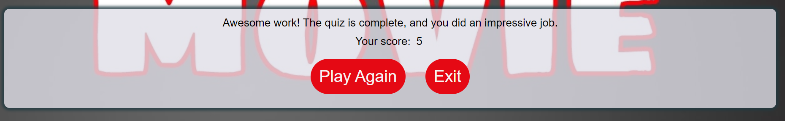

# Movie Trivia Website

## Project Overview

Welcome to the Movie Trivia Website, inspired by a love for films and quizzes. This project aims to provide a fun and interactive way to test your movie knowledge through a series of questions ranging from classics to new blockbusters. Whether you're a film buff or just looking for a fun way to pass time, this quiz is for you!

Experience the quiz live here: [Movie Trivia Website](https://ramibrown.github.io/Movie-Trivia/).

## Technologies Used

- **HTML**: For structuring the content of the quiz.
- **CSS3**: For styling and making the quiz visually appealing.
- **JavaScript**: For quiz logic and interactivity.

- **GitHub Pages**: For hosting the live version of the quiz.
- **Am I Responsive?**: To ensure the quiz is responsive on all devices.
- **HTML Validator**: To ensure code quality and standards.
- **CSS Validator**: To check for any CSS issues.
- **JSHint**: To ensure the JavaScript is error-free.

## Key Project Goals

- Create an engaging user experience with immediate feedback on answers.
- Design a visually appealing site that is easy to navigate and responsive across all devices.
- Implement a scoring system that tracks the user's progress throughout the quiz.

## Features

- **Interactive Quiz Start**: Users can start the quiz by clicking on a prominently displayed button.
- **Score Tracking**: Scores are updated in real-time as users select their answers.
- **End-of-Quiz Feedback**: Users receive feedback on their performance at the end of the quiz with options to retry or exit.

    

### Color Palette

- The color scheme was chosen to be easy on the eyes with a classic combination that evokes the cinematic experience.

### Fonts

- Fonts used is Montserrat for clean readability and a professional look, enhancing the user interface.

## Testing

- **HTML Validator**: Used to ensure code quality and standards.

- **CSS Validator**: Used to check for any CSS issues.

- **Lighthouse report**

- Peer Code Review through GitHub to gather feedback and make improvements.
- Functional testing was conducted by friends and family to ensure the quiz works seamlessly on various devices and browsers.

## Deployment

- The website is deployed on GitHub Pages, ensuring it is accessible to a wide audience. 

## Bugs

- No major bugs were encountered during the deployment. Minor styling issues were resolved during the development process.

## Credits

- **Community Forums**: Valuable insights were gained from discussions on Stack Overflow.

## Future Enhancements

- **Leaderboard**: Implement a leaderboard to allow users to see how they rank against others.
- **More Questions**: Continuously expanding the question set to keep the quiz fresh and challenging.

